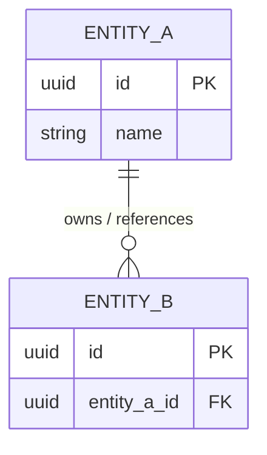

# Data Model & Storage Strategy

## 1. Storage Strategies & Technologies
<!-- 
    What data stores are being used, and what is the overarching strategy for where data lives?
    Consider: Primary databases, caching layers, blob/file storage (S3), and hot/cold data separation.
-->
*   **Primary Store:** [e.g., PostgreSQL / MongoDB / DynamoDB / Neo4j]
    *   *Rationale:*[Why is this the best fit for the primary operational data?]
*   **Caching / Ephemeral Store:** [e.g., Redis / Memcached]
    *   *Rationale:* [What data is cached and why? (e.g., User sessions, rate limits)]
*   **Blob / Object Storage:** [e.g., AWS S3 / Cloudflare R2 / Local File System]
    *   *Rationale:* [Where do user uploads, images, or large documents live?]
*   **Data Archiving / Cold Storage:**[e.g., Glacier / BigQuery]
    *   *Rationale:*[How is old or historical data handled to keep the primary store fast?]

---

## 2. Data Dictionary (Core Entities)
<!-- 
    Define the primary nouns of the system. 
    - Relational: Tables and Columns.
    - Document: Collections and Fields.
    - Graph: Nodes and Properties.
-->

### Entity: `[Entity Name, e.g., User, Order, Post]`
*   **Description:** [What does this entity represent in the business domain?]
*   **Storage Location:** [Which database/technology stores this?]

| Attribute / Field | Data Type | Nullable | Description |
| :--- | :--- | :--- | :--- |
| `id` | UUID/UUIDv4/Int | No | Primary Identifier. |
| `[field_name]` |[type] | [Yes/No] | [What is this used for?] |
| `[field_name]` | [type] | [Yes/No] | [What is this used for?] |

*(Repeat block for each major entity)*

---

## 3. Relationships & Data Flow
<!-- 
    How do these entities connect? 
    Use a Mermaid diagram to visualize the structure. 
    - For Relational: Use an ER Diagram (`erDiagram`).
    - For Document: Show embedding vs. referencing (`classDiagram`).
    - For Graph: Show nodes and edges (`flowchart`).
-->

---

## 4. Data Integrity & Constraints
<!-- 
    Define the rules that govern how data remains valid and consistent over time.
    If using NoSQL, explain how referential integrity is handled at the application layer.
-->
*   **Uniqueness:**[Which fields must be unique across the system? e.g., Email addresses, SKUs.]
*   **Referential Integrity:**[How do we prevent orphaned records? e.g., Cascading deletes on SQL Foreign Keys, or background cleanup jobs for NoSQL.]
*   **State Constraints:**[What are the valid states for data? e.g., An Order status can only be 'Pending', 'Paid', or 'Shipped'. Validated via DB Check Constraints or Application Enums?]
*   **Immutability:**[Are there records that should never be updated or deleted once created? e.g., Audit logs, financial transactions.]

---

## 5. Indexing Strategy
<!-- 
    How do we ensure queries remain fast as the dataset grows to millions of records?
-->
*   **Primary Access Patterns:**[What are the most common ways this data will be queried? e.g., "Find user by email", "List all posts for a user ordered by date".]
*   **Planned Indexes:**
    *   `Entity.field`: [Type of index, e.g., B-Tree, Hash, GIN]. Reason: Used heavily in login lookups.
    *   `Entity.(field_A, field_B)`:[Compound Index]. Reason: Used for filtering dashboards by date and status.
*   **Partitioning / Sharding Keys (If applicable):**[For highly scalable NoSQL or distributed SQL databases, what is the partition/shard key? e.g., `tenant_id`].
