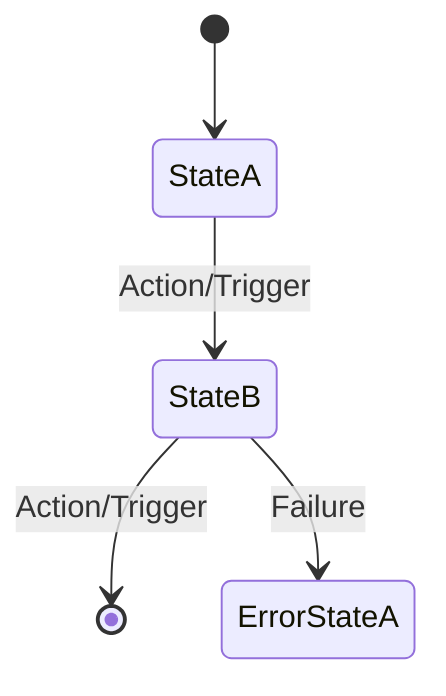

# Logic & Services (The Application Core)

This document outlines the pure business logic, domain services, and process orchestrators that drive the system. It defines how we enforce business rules and manage complex workflows.

---

## 1. Core Domain Services
<!-- 
    Identify the primary "Orchestrators" or "Service Classes".
    What are the specialized workers that handle specific business logic?
    (e.g., UserService, PaymentOrchestrator, NotificationManager).
-->

### Service: `[ServiceName, e.g., FulfillmentService]`
*   **Responsibility:** [Describe the single, focused job of this service.]
*   **Key Dependencies:** [List core services or repositories this service interacts with.]
*   **Primary Workflows / Use Cases:**
    <!-- Describe the high-level logic for critical actions. -->
    1.  `[Action Name, e.g., ProcessOrder(data)]`:
        *   *Step 1:* [Logic step, e.g., Validate inventory availability]
        *   *Step 2:* [Logic step, e.g., Calculate tax and final price]
        *   *Step 3:* [Logic step, e.g., Trigger payment transaction]
        *   *Step 4:* [Logic step, e.g., Dispatch 'OrderProcessed' event]

### Service: `[ServiceName]`
*   **Responsibility:** [Description]
*   **Primary Workflows:** [Description]
    1.  `[Action Name]`:
        *   *Step 1:* [Logic step]

---

## 2. Business Rules & Domain Logic
<!-- 
    Define the non-negotiable rules of the business. 
    These are the 'if/then' constraints that must be true at all times.
-->

*   **[Rule Name, e.g., Tiered Access]:** [e.g., "Users in the 'Basic' tier cannot create more than 5 resources per month. This check must occur before the creation logic begins."]
*   **[Rule Name, e.g., Data Retention]:** [e.g., "Audit logs must be kept for 7 years and are immutable after creation."]
*   **[Rule Name]:** [Description of the business constraint].

---

## 3. Asynchronous Processes & Background Jobs
<!-- 
    Define logic that happens outside the main request-response cycle 
    (e.g., Cron jobs, Message Queue workers, Scheduled tasks).
-->

| Task Name | Trigger | Responsibility | Priority / SLA |
| :--- | :--- | :--- | :--- |
| **[e.g., Daily Cleanup]** | Scheduled (Cron) | Deletes expired session tokens from the cache. | Low (Daily at 03:00) |
| **[e.g., Image Processor]** | Event (Queue) | Generates thumbnails for uploaded profile pictures. | High (Within 60s) |
| **[Task Name]** | [Trigger] | [Job Description] | [SLA] |

---

## 4. State Machines & Lifecycle Logic
<!-- 
    If your entities have complex states (e.g., Order: DRAFT -> PAID -> SHIPPED), 
    define the valid transitions and the logic that triggers them.
-->

---

## 5. Domain Exceptions
<!-- 
    How does the logic communicate business-level failures?
    Define custom error types that the Interface layer can translate for the user.
-->
*   **`[ExceptionName, e.g., InsufficientFundsError]`**: Raised when [Condition].
*   **`[ExceptionName, e.g., EntityLockedError]`**: Raised when [Condition].
