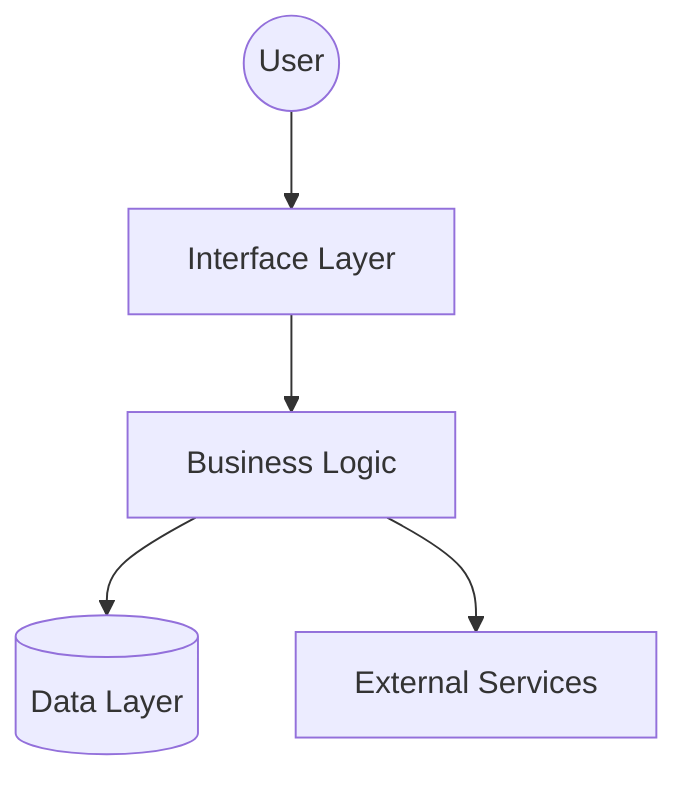

# Request for Design (RFD): [Module Name]

## 1. Project Status
*   **Current State:** [Proposed | Accepted]
*   **Last Updated:** [YYYY-MM-DD]

---

## 2. High-Level Architecture
<!-- 
    Visualize the system components and their interactions. 
    Standard: Use Mermaid TD (Top Down) or LR (Left to Right).
-->

---

## 3. Technical Strategy
<!-- 
    A brief summary of the chosen technology stack and the 
    fundamental reasoning behind the architecture. 
-->
*   **Core Stack:** [e.g., Python / Node.js / Go]
*   **Key Patterns:** [e.g., Hexagonal Architecture, Event-Driven, MVC]
*   **Strategy Summary:** [Why this approach was chosen for this module].

---

## 4. Modular Index
<!-- 
    The RFD is split into focused files to ensure technical reviews 
    remain deep and productive. 
-->
1. [**Structure & Dependencies**](./01_structure.md): Layout and external libraries.
2. [**Data Model**](./02_data_model.md): Storage, schemas, and integrity.
3. [**Interface Design**](./03_interface.md): Communication contracts (API/Web).
4. [**Logic & Services**](./04_logic.md): Business rules and service signatures.
5. [**Ops & Security**](./05_ops_and_security.md): Testing, deployment, and secrets.

---
*Maintenance Note: Any change to a sub-file requires the 'Current State' here to be set to 'Proposed' in the PR, and flipped to 'Accepted' upon merge.*
