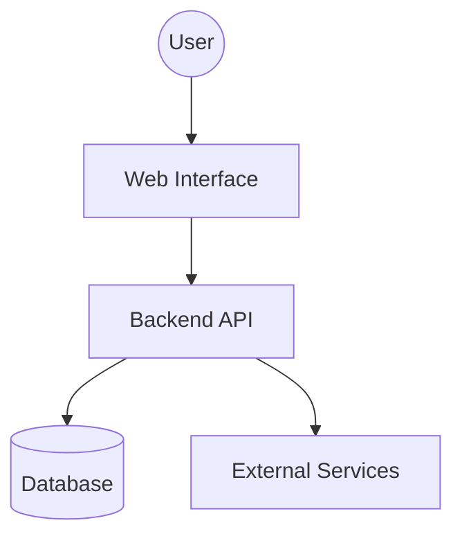

# Request for Design: [Project Name]

## 1. Project Status
*   **Current State:** [Proposed | Accepted]
*   **Last Updated:** [YYYY-MM-DD]

---

## 2. High-Level Architecture
<!-- 
    Visualize the system components and how they interact. 
    Use Mermaid TD (Top Down) or LR (Left to Right) graphs.
-->

---

## 3. Technical Strategy
<!-- 
    Summary of the chosen technology stack and the rationale 
    behind these choices. 
-->
*   **Language/Runtime:** [e.g., Python 3.13, Node.js 22]
*   **Frameworks:** [e.g., FastAPI, React]
*   **Databases:** [e.g., PostgreSQL, Redis]

---

## 4. Modular Index
<!-- 
    The RFD is split into focused files to enable targeted 
    architectural reviews via Pull Requests. 
-->
1. [**Structure & Dependencies**](./01_structure.md): Directory tree and external libraries.
2. [**Data Model**](./02_data_model.md): Database schema and entity relationships.
3. [**Interface Design**](./03_interface.md): API endpoints and web routes.
4. [**Logic & Services**](./04_logic.md): Business logic and method signatures.
5. [**Ops & Deployment**](./05_ops.md): Testing, deployment, and monitoring.

---
*Note: This document is the source of truth for "How" we are building. All specifications in this folder must align with the approved Product Requirements Document (PRD).*
