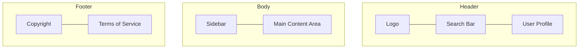

# View: [Screen Name]

**Associated User Story:** [e.g., US-01]  
**Device Target:** [e.g., Desktop / Mobile / Responsive]

---

## 1. Information Architecture (Structure)
<!-- 
    Define the hierarchy and layout of the screen using text or diagrams.
    Focus on WHAT is on the screen, not HOW it looks.
-->

### Core Components
*   **[Component A]:** [e.g., Global Navigation Bar containing Logo, Search, and Profile].
*   **[Component B]:** [e.g., Main Sidebar with Navigation Links].
*   **[Component C]:** [e.g., Central Feed displaying a list of Items].

### Structural Wireframe
<!-- 
    Use a Mermaid Flowchart or ASCII to represent the layout logic.
-->

---

## 2. Interaction Logic & User Flow
<!-- 
    Describe how the user interacts with this specific view.
-->
*   **Primary Action:** [e.g., Clicking 'Submit' validates the form and sends a POST request].
*   **Navigation:** [e.g., Clicking an item in the feed navigates the user to the Detail View].
*   **Dynamic Behavior:** [e.g., The sidebar collapses on mobile devices].

---

## 3. State Specifications
<!-- 
    Describe the UI requirements for different application states.
-->
*   **Initial / Empty:** [What is shown when there is no data? e.g., A "Get Started" illustration].
*   **Loading:** [e.g., Skeleton loaders for the feed items].
*   **Error:** [e.g., A red toast notification for network failures].
*   **Success:** [e.g., A green checkmark animation upon successful save].

---

## 4. Visual Assets
<!-- 
    Link to high-fidelity designs or screenshots here.
-->
*   **Visual Mockup:** `[Link to screenshot in this folder or external Figma frame]`

---
*Maintenance Note: This document must be updated if the layout logic changes. It serves as the technical requirement for the Frontend implementation.*
