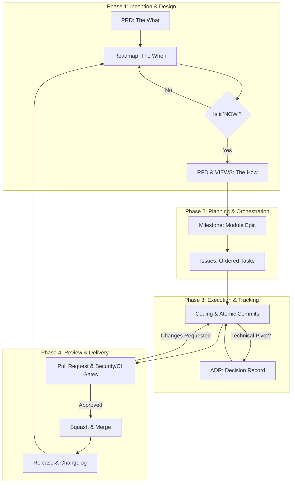

# Project Lifecycle

The development cycle is a structured approach that moves from an abstract product vision to concrete technical delivery. To maximize efficiency and prevent wasted effort, we follow the **Just-In-Time (JIT) Design** loop.

---

## 🌀 The Development Cycle Diagram

---

## 📑 Phase Descriptions

### Phase 0: Foundations & Guidelines (Prerequisite)
Before any project begins, the team must align on the "Rules of the House." This phase establishes the core philosophy, community standards, API architecture rules, security baselines, and testing targets. **These are read, not executed.**

### Phase 1: Inception & Design
The active cycle begins here. We establish the requirements and the sequence of delivery before writing implementation code.
1.  **PRD (The What):** Define the problem, user stories, and business goals in `docs/PRD/`.
2.  **ROADMAP (The When):** Sequence features into **Now, Next, and Later**. 
3.  **RFD & VIEWS (The How):** Technical design and AI-assisted UI wireframing are performed **ONLY** for modules currently in the **"Now"** column of the Roadmap. 

### Phase 2: Planning & Orchestration
Once the technical "How" for the current module is approved:
1.  **Milestones:** Initialize the module-centric Epic in the project planning folder.
2.  **Issues:** Populate the Milestone with discrete Tasks, assigning each a numeric **Execution Order** and clear **Dependencies**.

### Phase 3: Execution & Tracking
The building phase where the technical specification becomes reality.
1.  **Coding:** Developers follow strict [Branch Flow](./15_branch_flow.md) and security rules.
2.  **Atomic Progress:** Work is saved through [Atomic Commits](./16_commit_standards.md) that fulfill the task's requirements.
3.  **Decision Logging:** Mid-flight technical pivots are recorded as [ADRs](./17_adr_standards.md).

### Phase 4: Review & Delivery
The final gate ensuring only secure, high-quality code reaches production.
1.  **Pull Request:** Peer review and automated CI verification (Testing, Linting, Secret Scanning).
2.  **Merge:** Squash to `main` using GitHub configurations.
3.  **The Loop:** Once a Milestone meets its **Definition of Done**, the CI/CD pipeline triggers the release, the Changelog is updated, and the next priority from the "Next" column of the **Roadmap** is moved to **"Now"** to begin its RFD phase.

---

### 🚦 The Approval Gate
Documents in Phase 1 follow a strict status lifecycle:
*   **Proposed:** The document is on a feature branch and under review in a PR.
*   **Accepted:** The PR is approved and updated with this status before merged into `main`.
