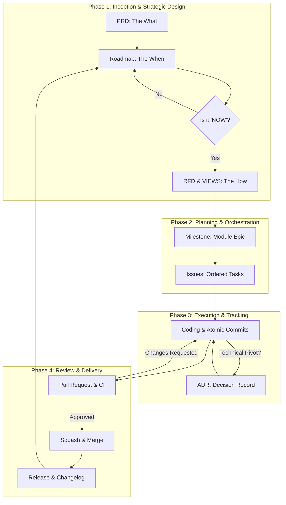

# Project Lifecycle

The development cycle is a structured approach that moves from abstract product vision to concrete technical delivery. To maximize efficiency and prevent wasted effort, we follow the **Just-In-Time (JIT) Design** loop.

---

## 🌀 The Development Cycle Diagram

---

## 📑 Phase Descriptions

### Phase 1: Inception & Strategic Design
Before writing implementation code, we establish the requirements and the sequence of delivery.
1.  **PRD (The What):** Define the problem, user stories, and business goals in `docs/PRD/`.
2.  **ROADMAP (The When):** Sequence features into **Now, Next, and Later**. 
3.  **RFD & VIEWS (The How):** **Crucial Rule:** Technical design and UI wireframing are performed **ONLY** for modules currently in the **"Now"** column of the Roadmap. 

### Phase 2: Planning & Orchestration
Once the technical "How" for the current module is approved:
1.  **Milestones:** Initialize the module-centric Epic in the project planning folder.
2.  **Issues:** Populate the Milestone with discrete Tasks, assigning each a numeric **Execution Order** and clear **Dependencies**.

### Phase 3: Execution & Tracking
1.  **Coding:** Developers follow the [Branch Flow](./12_branch_flow.md).
2.  **Atomic Progress:** Work is saved through [Atomic Commits](./13_commit_standards.md).
3.  **Decision Logging:** Mid-flight technical pivots are recorded as [ADRs](./14_adr_standards.md).

### Phase 4: Review & Delivery
1.  **Pull Request:** peer review and CI verification.
2.  **Merge:** Squash to main.
3.  **The Loop:** Once a Milestone meets its **Definition of Done**, the next priority from the "Next" column of the **Roadmap** is moved to **"Now,"** and its RFD phase begins.

---

### 🚦 The Approval Gate
Documents in Phase 1 follow a strict status lifecycle:
*   **Proposed:** The document is on a feature branch and under review in a PR.
*   **Accepted:** The PR is approved and merged into `main`. Implementation can only begin on "Accepted" specifications.
