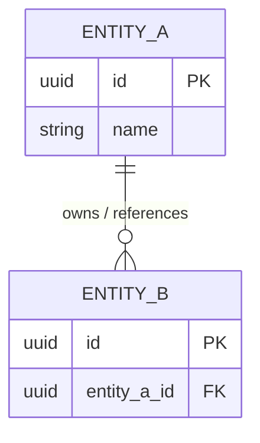

# Data Model & Storage Strategy

## 1. Storage Strategies & Technologies
<!-- 
    What data stores are being used, and what is the overarching strategy for where data lives?
    Consider: Primary databases, caching layers, blob/file storage, and hot/cold data separation.
-->
*   **Primary Store:** [e.g., PostgreSQL / MongoDB / Neo4j]
    *   *Rationale:* [Why is this the best fit for the primary operational data?]
*   **Caching / Ephemeral Store:** [e.g., Redis]
    *   *Rationale:* [What data is cached and why? (e.g., User sessions, rate limits)]
*   **Blob / Object Storage:** [e.g., AWS S3 / Local File System]
    *   *Rationale:* [Where do user uploads, images, or large documents live?]
*   **Vector / Search Store (If applicable):** [e.g., Pinecone / Elasticsearch]
    *   *Rationale:* [Why is a specialized search index required?]

---

## 2. Data Dictionary (Core Entities)
<!-- 
    Define the primary nouns of the system. 
    - Relational: Tables and Columns.
    - Document: Collections and Fields.
-->

### Entity: `[Entity Name, e.g., User, Order, Post]`
*   **Description:** [What does this entity represent in the business domain?]
*   **Storage Location:** [Which technology stores this?]

| Attribute / Field | Data Type | Nullable | Description |
| :--- | :--- | :--- | :--- |
| `id` | [e.g., UUID] | No | Primary Identifier. |
| `[field_name]` | [type] | [Yes/No] | [Purpose and validation rules] |
| `[field_name]` | [type] | [Yes/No] | [Purpose] |

---

## 3. Relationships & Data Flow
<!-- 
    Visualize how entities connect. 
    Standard: Use Mermaid erDiagram for Relational or flowchart for Document/Graph.
-->

---

## 4. Data Integrity & Constraints
<!-- 
    Define the rules that govern how data remains valid and consistent.
-->
*   **Uniqueness:** [Which fields must be unique? e.g., Email addresses, SKUs.]
*   **Referential Integrity:** [How do we prevent orphaned records? e.g., Cascading deletes, or application-layer cleanup.]
*   **State Constraints:** [e.g., "An Order status can only transition from PENDING to PAID."]
*   **Immutability:** [Are there records that should never be deleted? e.g., Audit logs.]

---

## 5. Indexing & Access Patterns
<!-- 
    How do we ensure queries remain fast as the dataset grows?
-->
*   **Primary Access Patterns:** [Describe common queries. e.g., "Find user by email", "Filter products by category and price".]
*   **Planned Indexes:**
    *   `Entity.field`: [Type of index, e.g., B-Tree, GIN, Hash]. 
    *   `Entity.(field_A, field_B)`: [Compound Index for specific filters].
*   **Partitioning / Sharding (If applicable):** [How is the data split for scale?]

---

## 6. Data Lifecycle & Archival Strategy
<!-- 
    Data is a liability. Define how it enters, ages, and exits the system.
-->
*   **Ingestion & Mutation:** [How is data validated and transformed before entry?]
*   **Retention Policy (TTL):** [How long does data remain in the 'Hot' store? e.g., "Logs are moved to archival after 30 days."]
*   **Archival & Cold Storage:** [What happens to old data? Is it compressed, moved to S3, or deleted?]
*   **Deletion / Anonymization:** [The protocol for permanent removal (e.g., GDPR 'Right to be forgotten'). Are deletes hard or soft?]

---

## 7. Operational Ceilings & Performance Targets
<!-- 
    Identify the "breaking point" of this data design.
-->
*   **Maximum Throughput:** [Estimated max concurrent writes/reads per second before latency exceeds SLA.]
*   **Storage Limits:** [At what volume (e.g., 100M rows) does this index strategy require refactoring?]
*   **Latency SLA:** [Target query response time, e.g., < 100ms for primary keys.]
